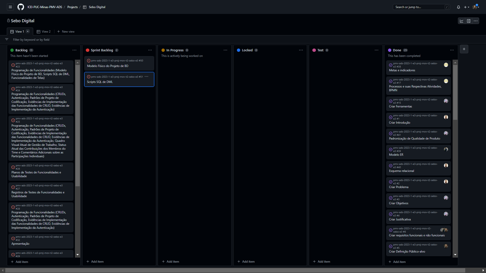
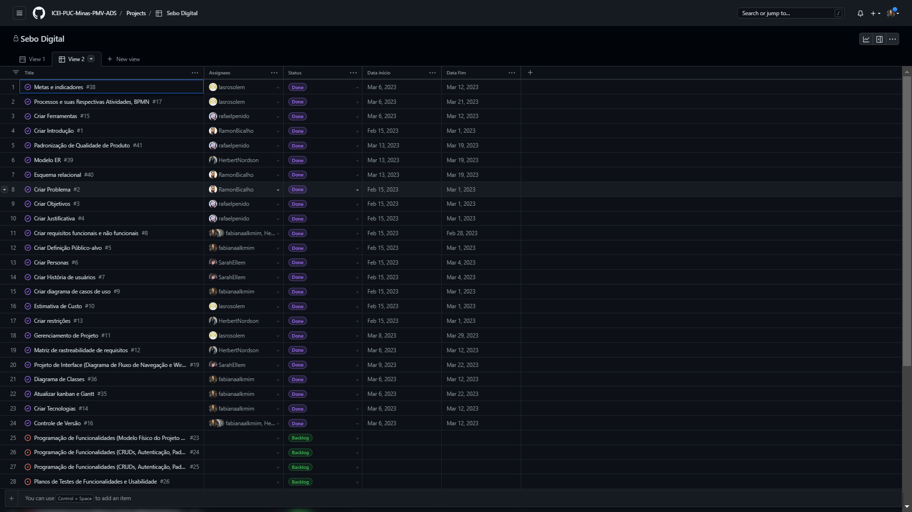
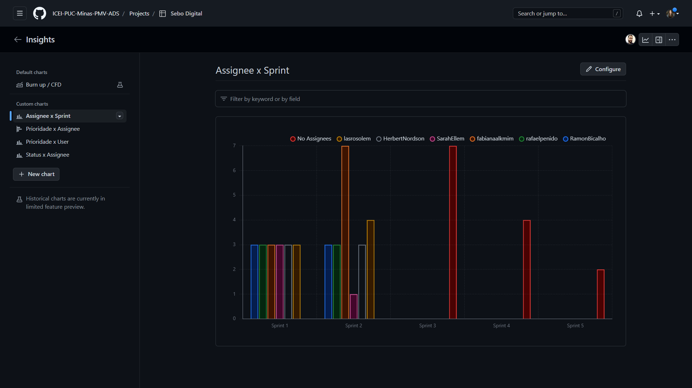
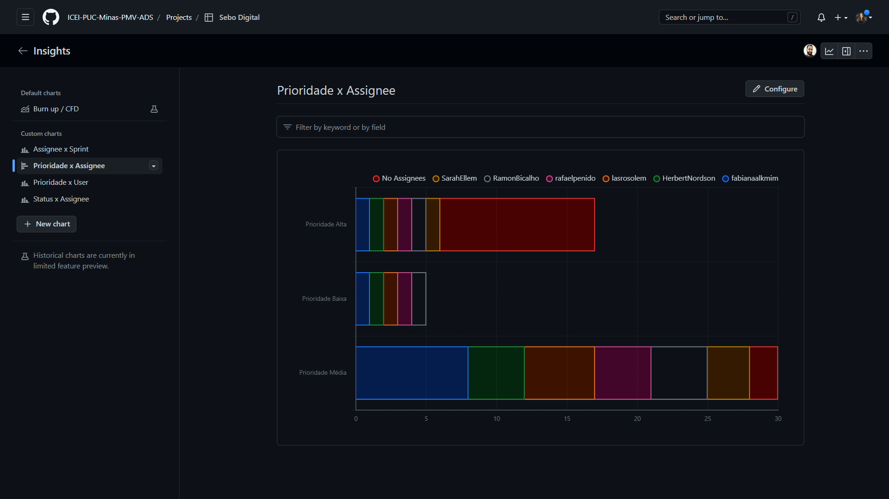
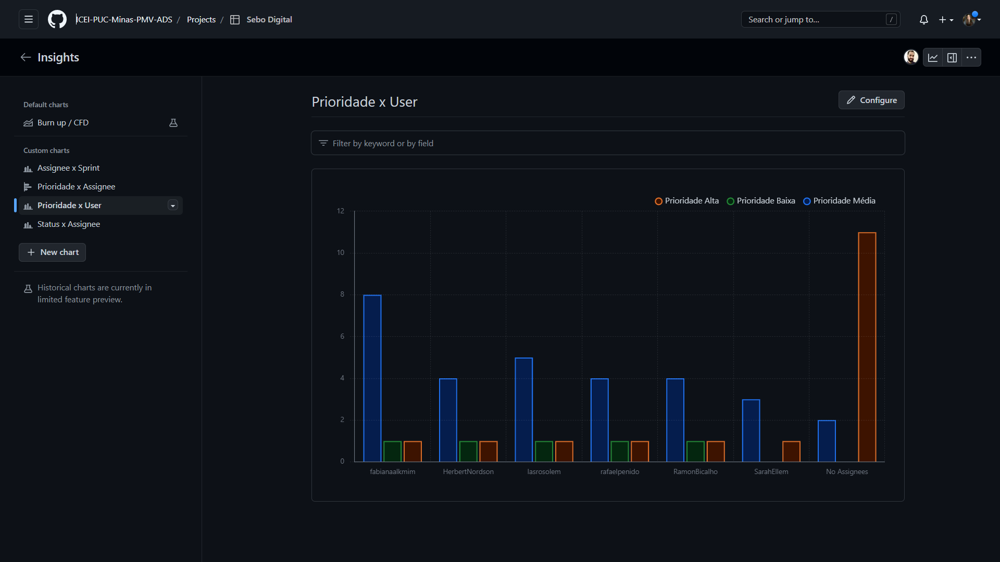
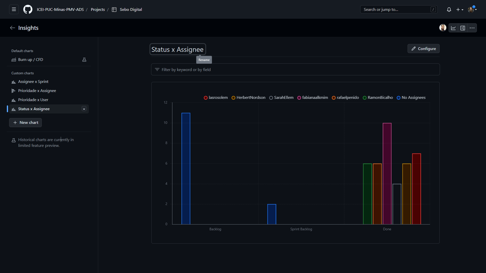

# Metodologia

Pré-requisitos: <a href="2-Especificação do Projeto.md"> Documentação de Especificação</a>

A metodologia deste trabalho consiste em apresentar o grupo de ferramentas presentes no projeto e a maneira pela qual tais recursos foram utilizados. Foram utilizados tanto recursos para a manutenção do código fonte, quanto ferramentas de gestão e organização de equipe na execução das etapas do projeto.

## Relação de Ambientes de Trabalho

A tabela abaixo demonstra as plataformas nas quais foram desenvolvidos os respectivos artefatos do projeto, além do link para acessá-los:

Ambiente   | Plataforma 
:--------- | :------:
Repositório de código fonte | [GitHub](https://github.com/ICEI-PUC-Minas-PMV-ADS/pmv-ads-2023-1-e3-proj-mov-t2-sebo-e3)
Projeto de Interface e Wireframes | [Figma](https://www.figma.com/file/OExu22cUkBSL6in4D06Z1V/Projeto-de-Interface?node-id=0-1&t=uS1KavmVOYREn57R-0) 
Gerenciamento do Projeto | [Kanban do Github](https://github.com/orgs/ICEI-PUC-Minas-PMV-ADS/projects/228) 
Ambiente de desenvolvimento integrado (IDE) | [Visual Studio Code](https://code.visualstudio.com/docs) 
Tecnologias para comunicação | [Teams](https://teams.microsoft.com/_#/school/conversations/Geral?threadId=19:LalckUyFc6HlgnKcRQrdHL5O64qQNmAdV5lP8mI4UsI1@thread.tacv2&ctx=channel) e [Whatsapp](https://chat.whatsapp.com/Gcen8ZvFSGx4VDSSAWxeXM)

## Controle de Versão

A ferramenta de controle de versão adotada no projeto foi o
[Git](https://git-scm.com/), sendo que o [Github](https://github.com)
foi utilizado para hospedagem do repositório.

O projeto segue a seguinte convenção para o nome de branches:

- `main`: versão estável já testada do software
- `unstable`: versão já testada do software, porém instável
- `testing`: versão em testes do software
- `dev`: versão de desenvolvimento do software

Quanto à gerência de issues, o projeto adota a seguinte convenção para
etiquetas:

- `documentation`: melhorias ou acréscimos à documentação
- `bug`: uma funcionalidade encontra-se com problemas
- `enhancement`: uma funcionalidade precisa ser melhorada
- `feature`: uma nova funcionalidade precisa ser introduzida

Discuta como a configuração do projeto foi feita na ferramenta de versionamento escolhida. Exponha como a gerência de tags, merges, commits e branchs é realizada. Discuta como a gerência de issues foi realizada.

## Gerenciamento de Projeto

### Divisão de Papéis

Apresente a divisão de papéis entre os membros do grupo.

Exemplificação: A equipe utiliza metodologias ágeis, tendo escolhido o Scrum como base para definição do processo de desenvolvimento. A equipe está organizada da seguinte maneira:
- Scrum Master: Fabiana Alkmim;
- Product Owner: Ramon Bicalho;
- Equipe de Desenvolvimento: Letícia Alves; Herbert Nordson; Rafael Penido; Sarah Ellem;

### Processo

Coloque  informações sobre detalhes da implementação do Scrum seguido pelo grupo. O grupo deverá fazer uso do recurso de gerenciamento de projeto oferecido pelo GitHub, que permite acompanhar o andamento do projeto, a execução das tarefas e o status de desenvolvimento da solução.

Como já dito, para o gerenciamento, organização e distribuição das tarefas, utiliza-se a ferramenta do Github. As Sprints estão estruturadas no formato de marcos, conforme demonstrado abaixo:

Além disso, temos o Backlog do Produto elaborado pelo grupo no GitHub, cujo acesso é possível através da URL:
[https://github.com/orgs/ICEI-PUC-Minas-PMV-ADS/projects/228]

Os entregáveis estão dispostos no “Product Backlog” e apresentados em método Kanban conforme andamento da atividade:
- **Recursos**: esta lista mantém um template de tarefas recorrentes com as configurações padronizadas que todos devem seguir. O objetivo é permitir a cópia destes templates para agilizar a criação de novos cartões. 
- **Backlog**: recebe as tarefas a serem trabalhadas e representa o Product Backlog. Todas as atividades identificadas no decorrer do projeto também devem ser incorporadas a esta lista. 
- **To Do**: Esta lista representa o Sprint Backlog. Este é o Sprint atual que estamos trabalhando. 
- **In Progress**: Quando uma tarefa tiver sido iniciada, ela é movida para cá. 
- **Test**: Checagem de Qualidade. Quando as tarefas são concluídas, eles são movidas para o “CQ”. No final da semana, eu revejo essa lista para garantir que tudo saiu perfeito. 
- **Locked**: Quando alguma coisa impede a conclusão da tarefa, ela é movida para esta lista juntamente com um comentário sobre o que está travando a tarefa. 
- **Done**: nesta lista são colocadas as tarefas que passaram pelos testes e controle de qualidade e estão prontos para ser entregues ao usuário. Não há mais edições ou revisões necessárias, ele está agendado e pronto para a ação. 

Abaixo, figura demonstrando a disposição dos entregáveis:

As tarefas são, ainda, etiquetadas em função da urgência da atividade e seguem o seguinte esquema de cores/categorias:

          - Vermelha: prioridade alta 
          - Amarela: prioridade média 
          - Verde: prioridade baixa 
          
As tarefas serão livres para qualquer membro do time poder executá-las ou direcionadas a determinado membro do time, que tenha mais experiência em determinada área de conhecimento. Com relação a livre escolha de tarefas, obrigatoriamente, deve ser respeitada a hierarquia de prioridades. Enquanto tiverem tarefas de maiores prioridades disponíveis, não poderão ser iniciadas as tarefas de menor prioridade, a prioridade padrão é a amarela, devendo ser vermelhas as prioridades urgentes que surgirem ao longo do projeto.  

Abaixo, figura demonstrando a disposição das etiquetas:

Adicionalmente, a ferramenta conta com um diretório para a criação de “Issues” que são pendências e problemas ainda não resolvidas, devendo ser tratadas e analisadas ao longo do projeto, conforme imagem abaixo:

### Ferramentas

As ferramentas empregadas no projeto são:

 Função |Ferramentas|Justificativa|
|--------|----------|--------------|
|Repositório de código fonte e documentação|GitHub|A ferramenta foi escolhida pois em cada eixo é disponibilizado aos alunos um repositório com o modelo dos tópicos e da documentação do curso, bem como uma integração robusta com boards de acompanhamento de projetos, facilitando a gestão de processos|
|Gerenciamento do Projeto|GitHub Projects|O Projects auxilia na integração de tarefas atribuídas à sua execução em commits|
|Editor de código |Visual Studio Code| Foi escolhido por sua integração com o sistema de versão, bem como extensões que agilizam o desenvolvimento de uma aplicação |
|Projeto de Interface e  Wireframes|Figma|A ferramenta foi escolhida por ser uma plataforma colaborativa completa para construção de design de interfaces e protótipos que agiliza o desenvolvimento visual de um projeto| 
|Comunicação e Reuniões|Microsoft Teams e Whats App|Foram ferramentas escolhidas pela conveniência e praticidade: contato com o professor e demais membros e acesso frequente diário, nessa ordem|

## Quadro Visual Atual de Gestão de Trabalho 

## Status Atual das Contribuições dos Membros do Time no Github ##

