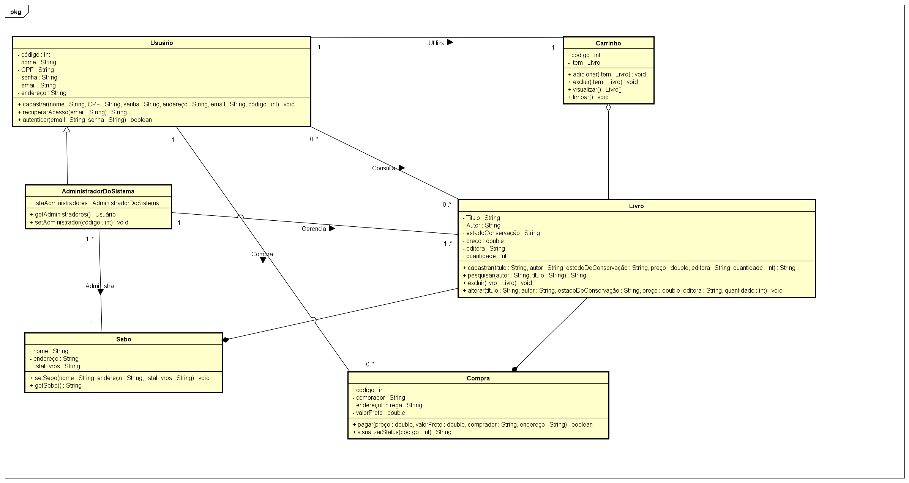

# Arquitetura da Solução

Pré-requisitos: <a href="3-Projeto de Interface.md"> Projeto de Interface</a>

Definição de como o software é estruturado em termos dos componentes que fazem parte da solução e do ambiente de hospedagem da aplicação.

## Diagrama de Classes

## Modelo ER

O Modelo ER representa através de um diagrama como as entidades (coisas, objetos) se relacionam entre si na aplicação interativa.]

## Esquema Relacional

O Esquema Relacional corresponde à representação dos dados em tabelas juntamente com as restrições de integridade e chave primária.

## Modelo Físico

Entregar um arquivo banco.sql contendo os scripts de criação das tabelas do banco de dados. Este arquivo deverá ser incluído dentro da pasta src\bd.

## Tecnologias Utilizadas

* IDEs de desenvolvimento: Visual Studio Code;
* Linguagens utilizadas: Javascript;
* Frameworks: React-Native;
* Local Storage: JSON;
* Ferramenta de design: Figma;
* Plataforma para hospedagem dos arquivos: GitHub, Azure e Google Play Store; 
* Ferramenta de divisão de tarefas: Github Project;

## Hospedagem

Explique como a hospedagem e o lançamento da plataforma foi feita.

> **Links Úteis**:
>
> - [Website com GitHub Pages](https://pages.github.com/)
> - [Programação colaborativa com Repl.it](https://repl.it/)
> - [Getting Started with Heroku](https://devcenter.heroku.com/start)
> - [Publicando Seu Site No Heroku](http://pythonclub.com.br/publicando-seu-hello-world-no-heroku.html)

## Qualidade de Software

O glossário do IEEE (Instituto de Engenheiros Eletrônicos e Eletricistas) define qualidade de software como “grau de conformidade de um sistema, componente ou processo com os respectivos requisitos, as necessidades e expectativas de clientes ou usuários.

A qualidade de software do projeto Sebo Digital segue os fundamentos descriminados na norma técnica ISO/IEC 25010 para a avaliação.

### Adequação funcional

O público-alvo do sebo é composto por pessoas que buscam livros usados a preços mais acessíveis em comparação com os preços de mercado. Esse público pode incluir estudantes, pesquisadores, colecionadores, aficionados por literatura e pessoas que apreciam produtos vintage ou raros.

### Eficiência de desempenho

Nenhum usuário gosta de um software lento. Normalmente ficam impacientes e dependendo da situação até desinstalam ou deixam de lado. Esse princípio reflete justamente esse aspecto. Chegamos ao consenso de que o software deve ser capaz de responder em tempo hábil, sem deixar o usuário esperando.

### Compatibilidade

O grupo preza pela capacidade de executar o software independente do dispositivo móvel. Essa caractéristica é muito importante, pois, permite alçancar um número maior de pessoas.

### Usabilidade

Durante as reuniões em grupo foi discutido a praticidade do uso do aplicativo e chegou-se à conclusão de que um design simples, porém funcional como o de outros sites para vendas de livros já existentes trará uma experiência prazerosa para o usuário.

### Confiabilidade

A aplicação será testada por nossos desenvolvedores durante todo o processo para identificar falhas durante sua execução, frequência de defeitos apresentados, disponibilidade para os usuários ou se ocorre algum comportamento inesperado durante seu funcionamento após alguma modificação.

### Segurança 

A segurança é um dos pontos mais importantes. Afinal, ninguém quer utilizar algo inseguro, portanto nós desenvolvedores dessa aplicação somos responsáveis por quaisquer informações inseridas pelos usuários no sistema.

### Capacidade de manutenção

A reusabilidade da aplicação significará reduzir custos e tempo no processo de desenvolvimento e manutenção, aumentar a qualidade, entre outras diversas vantagens. Como nossa aplicação será desenvolvida em React Native, será possível reutilizar componentes para se obter agilidade no desenvolvimento e manutenção.

### Portabilidade

Por fim a portabilidade será fundamental em nossa aplicação e será definida através da capacidade da aplicação ser facilmente transportável, ou seja, se é capaz de executar todas as suas funções em diferentes sistemas operacionais, como Android na versão 9.0 e IOS na versão 10.0. Nosso objetivo é que nossa aplicação possa ser utilizada por tipos de pessoas diferentes em diversos ambientes e dispostivos móveis.
